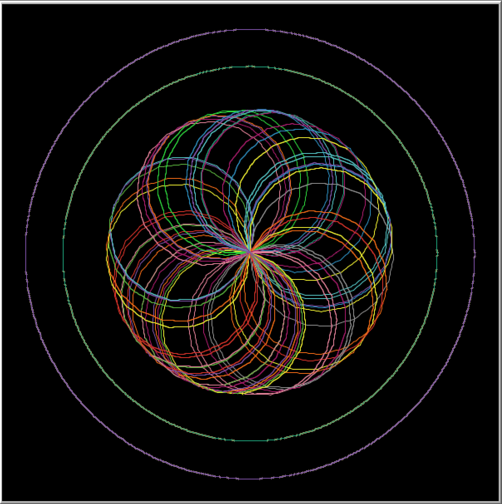

# Chrysalis
Chrysalis is an artwork created using NetLogo. It drew inspiration in the transformation of insects between the immature and mature stages. 
<div float="left">
  
  
</div>

## Documentation
Chrysalis is composed of three different functions that draws the outer circle, inner circle, and the geometrical figure.

For the outer circle, the x and y coordinates were set to 0. The value of the radius' circle is set to 90 and then used to compute for its circumference. The while function will make the turtle move until the circle is drawn. 
```
to outer-circle
  let x 0
  let y 0
  let r 90
  let p2r ( 2 * pi * r )
  let step p2r / 360

  crt 1 [
    setxy x + r y
    pd
    set heading 0
    while [ p2r > 0 ] [
      lt 1
      fd step
      set p2r p2r - step
    ]
    die
  ]
end
```
The same code is also applied with the inner circle with the exception that the radius is set to 75.

For the geometrical figure inside the two circles, the setup function first creates 50 turtles and then initializes it using pen down. The circles function then tasks the turtles to move forward by 10 steps and make a right turn by 20 degrees. 

```
to setup
  clear-all
  crt 50[
    pendown
  ]
end

to circles
    ask turtles[
      fd 10
      rt 20
    ]
end
```
In executing the program, the setup function goes first followed by the outer-circle, circle, and then the circles function. All buttons except the setup button are made to go 'forever' unless these buttons are pressed again which will lead for the function's execution to stop. 

##References
https://archives.evergreen.edu/webpages/curricular/2010-2011/natural-order/Labs/Computer_Lab_05_Spirals_and_Branches.pdf
